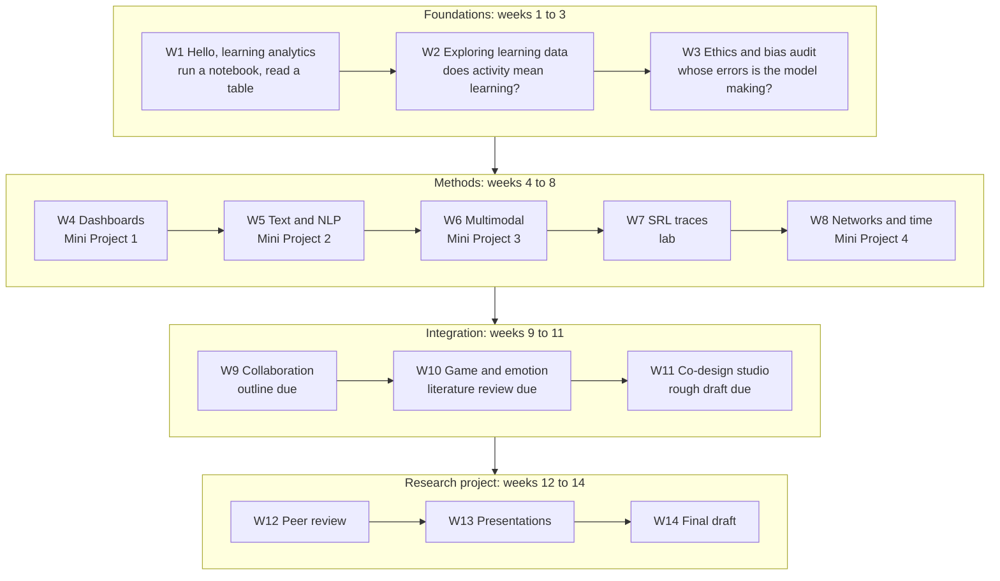

# 📊 EDIS 8100: Teaching and Learning Analytics

**Fall 2026 · Dr. Hakeoung Hannah Lee · University of Virginia School of Education and Human Development**

Wednesdays, 3:30 to 6:00 PM, Ridley 137. Department of Curriculum, Instruction, and Special Education.

This repository holds the hands-on half of the seminar: eleven notebooks, one for each of weeks 1 through 11, that take the ideas from the readings and put them in your hands. You will train an at-risk model and then audit it, build a teacher dashboard and then argue with it, read a forum as text and as a network, watch a group's talk time and a group's product move together, and follow two hundred middle schoolers through a fractions game. The notebooks are the place where the seminar's claims stop being claims and start being things you can check.

If you have never written a line of code, you are exactly who this repository was designed for. Every notebook runs top to bottom without you typing anything, builds its own data inside your browser, and asks you to change small clearly marked values rather than to write code from scratch. Nothing here can break your computer, your grade, or the course data.

## 🚀 Quickstart for students (three steps)

You need a Google account and a browser. That is all. There is nothing to install, nothing to download, and no CSV to keep track of.

### Step 1. Get access to this private repository (once, at the start of the semester)

This repository is **private**, so two things have to be true before Colab can open anything in it: you have accepted the instructor's invitation, and you have granted Colab permission to see private repositories. You do both one time and they keep working all semester.

1. **Accept the repository invitation.** Give the instructor your GitHub username in Week 1. She sends an invitation, which arrives as an email from GitHub and also appears at the top of [github.com](https://github.com) when you are signed in. Click **Accept invitation**. Until you accept, this repository is invisible to you and Colab reports that it does not exist.
2. Go to [colab.research.google.com](https://colab.research.google.com) and sign in with the Google account you will use for this course.
3. Choose **File > Open notebook**.
4. Click the **GitHub** tab.
5. Click **Authorize with GitHub** and sign in to GitHub. On the GitHub permission screen, make sure the box for **"Include private repositories"** is checked before you approve. **This is the step people miss**, and it produces a confusing "repository not found" message later.
6. In the repository dropdown, pick `HakeoungLee/edis8100-teaching-learning-analytics`. Leave the branch on `main`.

If you have done all of this and Colab still cannot find the repository, work through three things in this order: the invitation is still sitting unaccepted in your email, the private repositories box was not checked, or you are signed into a different Google account. Check the profile picture in the top right corner for the last one.

### Step 2. Open the week's notebook

After the authorization above, either use **File > Open notebook > GitHub** and click the notebook you want, or click the badge in that week's README. Every week folder has a README with its own badge, its own walkthrough, and its own troubleshooting list. Week 1 is [here](week01-hello-analytics/).

### Step 3. Run it, then save your own copy

Click into the first cell and press **Shift + Enter**. That runs the cell and moves you to the next one. Keep going, top to bottom, reading the text between the code cells as you go. The first cell takes a second or two because it is building the datasets. Everything after that is close to instant.

Before you start changing anything you want to keep, choose **File > Save a copy in Drive**. That copy is yours. Nothing you do to it can affect the course repository or anybody else's work.

**If something goes wrong**, the answer is almost always **Runtime > Restart session and run all**. It costs about ten seconds and fixes the large majority of notebook problems. Red error text is wordy, but it is not damage. Read the last line first, then raise your hand.

## 🗓️ Semester map

| Week | Date | Topic | Folder | Notebook activity | Deliverable |
|---|---|---|---|---|---|
| 1 | 8/26 | Course Introduction and Planning | [`week01-hello-analytics`](week01-hello-analytics/) | Meet Colab, read two tables, make three charts | Discussion leader sign-ups |
| 2 | 9/2 | Mapping the LA Landscape and Theoretical Lenses | [`week02-exploring-learning-data`](week02-exploring-learning-data/) | Merge clickstream with grades, ask what activity buys you | None |
| 3 | 9/9 | Responsible and Human-Centered LA | [`week03-ethics-bias-audit`](week03-ethics-bias-audit/) | Train an at-risk model, then audit its errors by group | None |
| 4 | 9/16 | Teacher and Student Facing LA and Dashboards | [`week04-miniproject1-dashboards`](week04-miniproject1-dashboards/) | Build a teacher dashboard, then critique it | Mini Project 1 plus AI interactions |
| 5 | 9/23 | Text-Based Analytics and NLP | [`week05-miniproject2-text-nlp`](week05-miniproject2-text-nlp/) | Forum text pipeline: frequencies, topics, discourse moves | Mini Project 2 plus AI interactions |
| 6 | 9/30 | Multimodal Learning Analytics | [`week06-miniproject3-multimodal`](week06-miniproject3-multimodal/) | Participation across speech, chat, gaze, and documents | Mini Project 3 plus AI interactions; mid-semester check-in |
| 7 | 10/7 | LA for Self-Regulated Learning | [`week07-srl-traces-lab`](week07-srl-traces-lab/) | Find SRL loops and hint spam in tutor action sequences | None |
| 8 | 10/21 | Networks and Temporal LA | [`week08-miniproject4-networks-temporal`](week08-miniproject4-networks-temporal/) | Forum reply network plus procrastination over time | Mini Project 4 plus AI interactions |
| 9 | 10/28 | LA for Collaboration | [`week09-collaboration-analytics-lab`](week09-collaboration-analytics-lab/) | Turn taking, response latency, and what a dashboard should not show | Project outline plus AI interactions |
| 10 | 11/4 | Game and Emotional LA | [`week10-game-emotional-analytics-lab`](week10-game-emotional-analytics-lab/) | FractionQuest learning curves and emotion streams | Literature review plus AI interactions |
| 11 | 11/11 | Designing and Co-Designing LA Systems | [`week11-codesign-studio`](week11-codesign-studio/) | Persona-driven dashboard sketching and critique | Rough draft plus AI interactions |
| 12 | 11/18 | Project Day: Peer Review and Instructor Feedback | [`project/`](project/) | No notebook. Two rounds of structured peer review | Peer review |
| 13 | 12/2 | Final Presentations | [`project/`](project/) | No notebook. Fifteen minutes each, 12 talk plus 3 questions | Final presentation |
| 14 | finals week | No class | [`project/`](project/) | No notebook. Revision week | Final draft plus AI interactions |

There is no class on 10/14, between weeks 7 and 8. Thanksgiving break runs 11/25 to 11/29, so there is no class on 11/25. Exact due dates and times live in Canvas.

Guest speakers join us in weeks 3, 4, 5, 7, 8, and 10. Student-led discussion runs from week 3 through week 11, which is nine weeks and eighteen leader slots, so each of the six of you co-leads three times with a different partner each time.

## 🧭 The arc of the semester



Read it as four movements. **Foundations** asks what learning analytics can and cannot see, and week 3 puts the first real crack in the assumption that a good model is a fair one. **Methods** hands you one family of methods per week and asks you to complete a full workflow with each: four mini projects, four chances to make something and then criticize it. **Integration** is where the methods start talking to each other and where your own project begins to take shape, one milestone per week. **The research project** is what the other eleven weeks were for.

## 📁 Repository structure

```
edis8100-teaching-learning-analytics/
├── README.md                       you are here
├── LICENSE                         MIT for code, CC BY-NC 4.0 for course materials
├── requirements.txt                only needed if you run notebooks locally
├── data/
│   ├── README.md                   the data dictionary and the ethics note. Read this one.
│   ├── generate_all_data.py        one seeded generator, eleven CSVs, about one second
│   ├── verify_phenomena.py         statistical checks that the data still behave
│   ├── students.csv                the EDUC 1010 roster
│   ├── lms_clickstream.csv         41,117 LMS events
│   ├── gradebook.csv               1,080 scores
│   ├── forum_posts.csv             1,456 posts
│   ├── group_chat.csv              6,379 studio backchannel messages
│   ├── mmla_studio.csv             960 student-by-session multimodal rows
│   ├── studio_artifacts.csv        192 group products
│   ├── srl_traces.csv              30,150 tutor actions
│   ├── game_players.csv            200 FractionQuest players with pre and post scores
│   ├── game_telemetry.csv          1,428 level attempts
│   └── game_emotion.csv            2,175 in-game emotion pings
├── week01-hello-analytics/
│   ├── README.md                   at a glance, walkthrough, stretch goals, troubleshooting
│   ├── week01_hello_learning_analytics.ipynb
│   └── data/                       built by the notebook when you run it, not stored in git
├── week02-exploring-learning-data/
├── week03-ethics-bias-audit/
├── week04-miniproject1-dashboards/
├── week05-miniproject2-text-nlp/
├── week06-miniproject3-multimodal/
├── week07-srl-traces-lab/
├── week08-miniproject4-networks-temporal/
├── week09-collaboration-analytics-lab/
├── week10-game-emotional-analytics-lab/
├── week11-codesign-studio/
│                                   each week folder holds one notebook, one README,
│                                   and a data/ folder the notebook creates for itself
└── project/
    ├── README.md                   the Course Research Project guide
    ├── proposal_outline_template.md
    ├── peer_review_form.md
    ├── final_presentation_rubric.md
    └── final_submission_checklist.md
```

Nothing needs to be cloned, uploaded, or authorized. The synthetic weeks carry their own generator inside the notebook, and the real-data weeks pull their files over plain HTTPS from a public companion repository.

## 🌍 The data

This course uses two real published datasets and one invented world, and which one you are holding matters, so every notebook says so before it does anything else.

### The real data

**OULAD**, the Open University Learning Analytics Dataset. Used in **weeks 2, 3, 4, and the temporal half of week 8**. Virtual learning environment clickstream, assessment submissions, and demographics from the UK Open University, including an area-level deprivation decile. The labs work with module BBB across two presentations, which is 4,529 enrollments, 891,062 daily click rows, and 21,783 submissions. Released **CC BY 4.0**.

> Kuzilek, J., Hlosta, M., & Zdrahal, Z. (2017). Open University Learning Analytics dataset. *Scientific Data*, 4, 170171.

**PERSUADE 2.0**. Used in **week 5**. Argumentative essays written by United States students in grades 6 to 12, with every discourse element annotated by a human and rated for effectiveness, plus writer demographics. The lab works with four prompts, which is 5,531 essays and 63,211 annotated spans. Released **CC BY-NC-SA 4.0, non-commercial use only**.

> Crossley, S. A., Baffour, P., Tian, Y., Franklin, A., Benner, M., & Boser, U. (2024). A large-scale corpus for assessing written argumentation: PERSUADE 2.0. *Assessing Writing*, 61.

Course-sized extracts of both, with their licenses and the script that rebuilds them from the originals, live at **[HakeoungLee/edis8100-datasets](https://github.com/HakeoungLee/edis8100-datasets)**.

### The invented world

**EDUC 1010: Learning How to Learn** at the fictional Blue Ridge University. Used in **weeks 1, 6, 7, 9, and 11, the network half of week 8, and as the deliberate contrast case in week 3**. One hundred and twenty students, eight instructional weeks, a Canvas-style LMS, a threaded forum, twenty-four studio groups meeting Thursday afternoons, and an adaptive practice tutor. **FractionQuest**, a middle school fractions game with two hundred players, is used in **week 10**. Every row was generated by `data/generate_all_data.py` with numpy seed 8100.

### Why both, on purpose

The synthetic weeks are not a fallback for the weeks we could not find data for, though that is part of it. Multimodal sensor data, threaded forum networks, and tutor traces with goal-setting actions have no openly licensed equivalent you can download without a data use agreement, and saying so is part of what this course teaches about the field.

The deeper reason is in week 3, where you run the same fairness audit twice. In the synthetic data the mechanism was written down before the data existed, so you can prove where the bias came from. In OULAD you find a real gap, from real students, and its cause is contested and always will be. Verifying a mechanism you already know and arguing about one you cannot see are different skills, and a researcher who has only ever done one of them has a blind spot.

Week 8 makes the same point from the other direction. Six weeks of synthetic data will have taught you that submitting close to a deadline goes with lower scores. Then you test it on 15,229 real submissions and it is not there.

### The ethics note, which is not boilerplate

Learning analytics runs on data about people who usually did not get to weigh in on being measured. The synthetic data exists so that you can rehearse the judgment without surveilling anyone. The real data exists because at some point the rehearsal has to end.

The people in OULAD and PERSUADE are real. They were students. They consented to being taught, and their records were anonymized and released by researchers who thought the field would learn something. **Treat both datasets as if they were real**, because one of them is. Ask who could be harmed by a claim before you make it. Notice when a metric flattens a person. Notice when your model is confidently wrong about a group.

Full documentation of the synthetic universe, including the row-by-row data dictionary, is in [`data/README.md`](data/README.md). For where to find data for your own project, see the course guide *Finding and Evaluating Learning Analytics Data*.

## 🔧 Instructor quickstart

Tested with `/opt/anaconda3/bin/python3` (Python 3.12, numpy 1.26, pandas 2.2). Run everything from the repository root.

**Regenerate the datasets.** One seed, deterministic, about one second. The CSVs land next to the script in `data/`.

```bash
/opt/anaconda3/bin/python3 data/generate_all_data.py
```

**Verify the planted phenomena.** This checks correlation magnitudes, the direction and size of the false positive rate gap, cluster and group mean differences, the Gini to artifact relationship, and the pre to post gain comparisons. **All nine must print PASS**, and the script exits nonzero if any single phenomenon has drifted out of the range the notebooks depend on.

```bash
/opt/anaconda3/bin/python3 data/verify_phenomena.py
```

**Execute every notebook end to end.** Nothing is committed until it runs clean with zero errors.

```bash
for nb in week*/week*.ipynb; do /opt/anaconda3/bin/python3 -m jupyter nbconvert --to notebook --execute --inplace "$nb" || echo "FAILED: $nb"; done
```

If you change a generator function in `data/generate_all_data.py`, run the verifier before committing, then update the embedded copy of that function in every notebook that uses it and re-run those notebooks. The embedded copies are what make the notebooks work in Colab with no network access.

For local student use rather than Colab, `pip install -r requirements.txt` covers everything. Anaconda already ships all of it.

## 📄 License and credit

The code in this repository is released under the **MIT License**. The instructional materials, meaning the notebook narrative text, the READMEs, the project templates, and the rest of the writing, are released under **Creative Commons Attribution-NonCommercial 4.0 International (CC BY-NC 4.0)**. Full text and details in [`LICENSE`](LICENSE).

Course design, notebook design, and the data universe are by Dr. Hakeoung Hannah Lee, School of Education and Human Development, University of Virginia.

## 🤖 A reminder about documenting AI use

AI use is permitted in designated activities in this course and must be documented. Undisclosed use is an Honor Code violation.

Starting with Mini Project 1 in week 4, every mini project submission and every course project milestone includes an **AI Reflection** submission on Canvas, and it has two parts that go in two different places on that page:

- **The conversation record goes in a Word file, attached to the submission.** The full exchange, across every tool and every session, pasted in. Not a summary, and not into the text box.
- **The reflection goes in the Canvas text box**, where you copy in the four questions from the syllabus and answer each one: how you used it; whether it helped and how; whether it made your work more challenging in any way; and what lesson about AI you would pass on to a friend or the class.

You are not graded on how much or how little AI you used. You are graded on the work. Build the habit in weeks 1 through 3, while nothing is being collected, because starting it under a deadline is much harder.

---

EDIS 8100: Teaching and Learning Analytics · Fall 2026 · Dr. Hakeoung Hannah Lee · University of Virginia School of Education and Human Development
