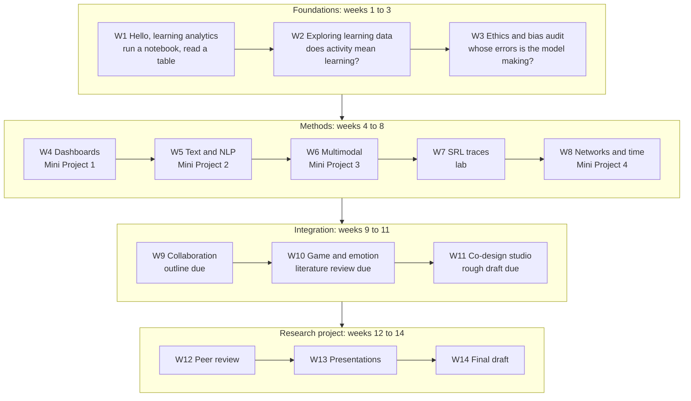

# EDIS 8100: Teaching and Learning Analytics

**Fall 2026 · Dr. Hakeoung Hannah Lee · University of Virginia School of Education and Human Development**

Wednesdays, 3:30 to 6:00 PM, Ridley 137. Department of Curriculum, Instruction, and Special Education.

This repository holds the hands-on half of the seminar: eleven notebooks, one for each of weeks 1 through 11, that turn the ideas from the readings into analyses you run yourself. You will train a model that predicts who does not complete a course and then audit it in two countries, build a teacher dashboard and then critique it, read a MOOC forum as a network, put a microphone and an event log side by side on the same twenty children, and follow children through two science games that disagree with each other. In the notebooks you check the seminar's claims against the data.

If you have never written a line of code, you are exactly who this repository was designed for. Every notebook runs top to bottom without you typing anything, downloads its own published dataset over the internet, and asks you to change small clearly marked values rather than to write code from scratch. Nothing here can break your computer, your grade, or the course data.

## Quickstart for students

You need a Google account and a browser. That is all. There is nothing to install, nothing to download, and no CSV to keep track of.

### Step 1. Open a notebook

This repository is public, so a notebook link opens in Colab with nothing to accept and no permission to grant. You need a Google account and a browser.
1. Go to [colab.research.google.com](https://colab.research.google.com) and sign in with the Google account you will use for this course.
2. Please choose **File > Open notebook**.
3. Click the **GitHub** tab.
4. In the repository dropdown, pick `HakeoungLee/edis8100-teaching-learning-analytics`. Leave the branch on `main`.

If Colab still cannot find the notebook, you are probably signed into a different Google account. Check the profile picture in the top right corner.

### Step 2. Open the week's notebook

After the authorization above, either use **File > Open notebook > GitHub** and click the notebook you want, or click the badge in that week's README. Every week folder has a README with its own badge, its own walkthrough, and its own troubleshooting list. Week 1 is [here](week01-hello-analytics/).

### Step 3. Run it, then save your own copy

Click into the first cell and press **Shift + Enter**. That runs the cell and moves you to the next one. Keep going, top to bottom, reading the text between the code cells as you go. The first cell takes a second or two because it is downloading this week's dataset. Everything after that is close to instant.

Before you start changing anything you want to keep, choose **File > Save a copy in Drive**. That copy is yours. Nothing you do to it can affect the course repository or anybody else's work.

**If something goes wrong**, the answer is almost always **Runtime > Restart session and run all**. It costs about ten seconds and fixes the large majority of notebook problems. Red error text is long, and none of it means anything has been damaged. Read the last line first, then raise your hand.

## Semester schedule

| Week | Date | Topic | Folder | Notebook activity | Deliverable |
|---|---|---|---|---|---|
| 1 | 8/26 | Course Introduction and Planning | [`week01-hello-analytics`](week01-hello-analytics/) | Meet Colab, read one real table, find what the summary was hiding | Discussion leader sign-ups |
| 3 | 9/9 | Responsible and Human-Centered LA | [`week03-ethics-bias-audit`](week03-ethics-bias-audit/) | Predict non-completion, then audit whose errors the model makes | None |
| 4 | 9/16 | Teacher and Student Facing LA and Dashboards | [`week04-miniproject1-dashboards`](week04-miniproject1-dashboards/) | Build a teacher dashboard, then critique it | Mini Project 1 plus AI interactions |
| 5 | 9/23 | Text-Based Analytics and NLP | [`week05-miniproject2-text-nlp`](week05-miniproject2-text-nlp/) | Student essays: frequencies, topics, and human-annotated discourse moves | Mini Project 2 plus AI interactions |
| 6 | 9/30 | Multimodal Learning Analytics | [`week06-miniproject3-multimodal`](week06-miniproject3-multimodal/) | Two ledgers of the same session: speech against interface actions | Mini Project 3 plus AI interactions; mid-semester check-in |
| 7 | 10/7 | LA for Self-Regulated Learning | [`week07-srl-traces-lab`](week07-srl-traces-lab/) | Sessions, order, and dwell in 1.9 million tutor actions, and two logging artifacts | None |
| 8 | 10/14 | Networks and Temporal LA | [`week08-miniproject4-networks-temporal`](week08-miniproject4-networks-temporal/) | Forum reply network, survival, prediction horizon, and submission timing | Mini Project 4 plus AI interactions |
| 9 | 10/21 | LA for Collaboration | [`week09-collaboration-analytics-lab`](week09-collaboration-analytics-lab/) | Unevenness against its chance floor, a clock that cannot support latency, and what a dashboard should refuse to show | Project outline plus AI interactions |
| 10 | 10/28 | Game and Emotional LA | [`week10-game-emotional-analytics-lab`](week10-game-emotional-analytics-lab/) | Persistence at a difficulty spike in two games, and an in-game affect item | Literature review plus AI interactions |
| 11 | 11/4 | Designing and Co-Designing LA Systems | [`week11-codesign-studio`](week11-codesign-studio/) | Persona-driven dashboard sketching and critique | Rough draft plus AI interactions |
| 12 | 11/11 | Project Day: Peer Review and Instructor Feedback | [`project/`](project/) | No notebook. Two rounds of structured peer review | Peer review |
| 13 | 11/18 | Reading Research Critically, and Your Own AI Trace | [`week13-reading-critically`](week13-reading-critically/) | Deficit framing, a reference-list audit, then your own AI logs | None |
| 14 | 12/2 | Final Presentations | [`project/`](project/) | No notebook. A full 15 minutes of talk each, then 9 minutes of questions | Final presentation |
| 15 | finals week | No class | [`project/`](project/) | No notebook. Revision week | Final draft plus AI interactions |

Fall reading days run Saturday to Tuesday, so no Wednesday meeting is affected and the class meets every week from 8/26 to 11/18. Thanksgiving break runs 11/25 to 11/29, so there is no class on 11/25. Exact due dates and times live in Canvas.

Guest speakers join us in weeks 4, 5, 7, and 10. Weeks 4 and 5 hold 4:30 to 5:30. Weeks 7 and 10 hold 5:00 to 6:00. With three students there are six leadership turns, so all four guest weeks run without a student-led block and the instructor takes the 3:40 to 4:40 hour in weeks 7 and 10. Weeks 2, 3, 6, 8, 9, and 11 include a student-led discussion block at 3:40 to 4:40, so each of the three of you leads twice, alone.

## Sequence of the semester



**Foundations** asks what learning analytics can and cannot see, and week 3 tests the assumption that a good model is a fair one. **Methods** gives you one family of methods per week and asks you to complete a full workflow with each, in four mini projects that ask you to build something and then criticize it. **Integration** combines the methods and moves your own project forward by one milestone a week. **The research project** draws on what the other eleven weeks covered.

## Repository structure

```
edis8100-teaching-learning-analytics/
├── README.md                       you are here
├── LICENSE                         MIT for code, CC BY-NC 4.0 for course materials
├── requirements.txt                only needed if you run notebooks locally
├── week01-hello-analytics/
│   ├── README.md                   at a glance, walkthrough, stretch goals, troubleshooting
│   └── week01_hello_learning_analytics.ipynb
├── week02-exploring-learning-data/
├── week03-ethics-bias-audit/
├── week04-miniproject1-dashboards/
├── week05-miniproject2-text-nlp/
├── week06-miniproject3-multimodal/
├── week07-srl-traces-lab/
├── week08-miniproject4-networks-temporal/
├── week09-collaboration-analytics-lab/
├── week10-game-emotional-analytics-lab/
├── week11-codesign-studio/
├── week13-reading-critically/          each week folder has the same two files
└── project/                        research project guide, outline template,
                                    peer review form, presentation rubric, checklist
```

No data file needs to be cloned, uploaded, or authorized. Every notebook pulls its own files over plain HTTPS from a public companion repository, with no account and no password. The one authorization in this course is Step 1 above, which is about opening the *notebooks* in this private repository, and it is a one-time step.

## The data

**Every lab in every week runs on real, published, openly licensed data. There is no synthetic data anywhere in this course.** The labs run on nine sources released under four licenses, each one collected by somebody else for their own reasons and released so that people outside the institution could work on it. Every notebook states its origin, its license, and its citation before it loads a single row, because you should never analyze data whose origin you cannot state.

| Source | Weeks | What one row is | License |
|---|---|---|---|
| **UCI Student Performance** (mathematics file), 395 Portuguese secondary students, 2005-06 | 1, and the second setting of 3 | one student | CC BY 4.0 |
| **OULAD**, UK Open University, module BBB, presentations 2013J and 2014J: 4,529 enrollments, 891,062 daily click rows, 21,783 submissions, with an area-level deprivation decile | 2, 3, 4, and the temporal half of 8 | one enrollment, or one student-resource-day | CC BY 4.0 |
| **PERSUADE 2.0**, a four-prompt subset: 5,531 argumentative essays by United States students in grades 8 to 12, 63,211 human-marked spans, each rated for effectiveness | 5 | one essay, or one annotated span | CC BY-NC-SA 4.0, non-commercial only |
| **JUSThink Dialogue and Actions Corpus** and **PE-HRI / PE-HRI-temporal**, CHILI lab at EPFL: 78 children aged 9 to 12, in 39 pairs, working with a robot | 6, and the second setting of 9 | one child, one team, or one 10-second window | CC BY 4.0 |
| **EdNet KT3**, a 500-user extract of the Santa TOEIC tutor in South Korea: 1,893,105 timestamped interface events | 7 | one interface event | CC BY-NC 4.0, non-commercial only |
| **edX discussion forum records** from one run of `UC3Mx IT.1.2x`: 1,478 posts by 311 people, with reply threading | the network half of 8 | one forum act | CC BY 4.0 |
| **Online collaborative learning chat log**, eight groups of undergraduates in a Spanish computer networks course, February 2021: 1,374 messages | 9 | one message | CC BY 4.0 |
| **Field Day Lab Open Game Data**: AQUALAB (*Wake: Tales from the Aqualab*) and WAVES (*Wave Combinator*), play logs from children in classrooms | 10 | one player-month, or one session | CC0 1.0 |
| **Canvas Network Person-Course (1/2014 - 9/2015)**: 325,199 rows across 238 open courses, including what registrants said they intended to do | 11 | one person in one course | CC BY 4.0 |

Course-sized extracts of all nine, with their licenses and the scripts that rebuild them from the originals, live at **[HakeoungLee/edis8100-datasets](https://github.com/HakeoungLee/edis8100-datasets)**.

Full citations:

> Cortez, P., & Silva, A. (2008). Using data mining to predict secondary school student performance. In *Proceedings of 5th FUture BUsiness TEchnology Conference*, 5-12.
>
> Kuzilek, J., Hlosta, M., & Zdrahal, Z. (2017). Open University Learning Analytics dataset. *Scientific Data*, 4, 170171.
>
> Crossley, S. A., Baffour, P., Tian, Y., Franklin, A., Benner, M., & Boser, U. (2024). A large-scale corpus for assessing written argumentation: PERSUADE 2.0. *Assessing Writing*, 61, 100865.
>
> Norman, U., Dinkar, T., Nasir, J., Bruno, B., Clavel, C., & Dillenbourg, P. (2021). *JUSThink Dialogue and Actions Corpus* [Data set]. Zenodo. https://doi.org/10.5281/zenodo.4627104
>
> Nasir, J., Norman, U., Bruno, B., Chetouani, M., & Dillenbourg, P. (2021). *PE-HRI* [Data set]. Zenodo. https://doi.org/10.5281/zenodo.4633092
>
> Nasir, J., Bruno, B., & Dillenbourg, P. (2024). *PE-HRI-temporal* [Data set]. Zenodo. https://doi.org/10.5281/zenodo.13834073
>
> Choi, Y., Lee, Y., Shin, D., Cho, J., Park, S., Lee, S., Baek, J., Bae, C., Kim, B., & Heo, J. (2020). EdNet: A large-scale hierarchical dataset in education. In *Artificial intelligence in education (AIED 2020)*, LNCS 12164 (pp. 69-73). Springer.
>
> Alario-Hoyos, C. (2021). *Dataset MOOC Forum edX* [Data set]. Zenodo. https://doi.org/10.5281/zenodo.5115573
>
> Villa-Torrano, C. (2021). *Dataset on an online collaborative learning situation in a computer networks course* [Data set]. Zenodo. https://doi.org/10.5281/zenodo.5150537
>
> Field Day. (2019). *Open educational game play logs: AQUALAB and WAVES* [Data set]. Field Day Lab, University of Wisconsin-Madison. Retrieved from https://opengamedata.fielddaylab.wisc.edu
>
> Gagnon, D., & Swanson, L. (2023). Open Game Data: A technical infrastructure for open science with educational games. In M. Haahr, A. Rojas-Salazar, & S. Göbel (Eds.), *Serious Games. JCSG 2023* (Lecture Notes in Computer Science, Vol. 14309, pp. 3-19). Springer.
>
> Canvas Network. (2016). *Canvas Network Person-Course (1/2014 - 9/2015) De-Identified Open Dataset* [Data set]. Harvard Dataverse. https://doi.org/10.7910/DVN/1XORAL

### Weeks that use two sources

**Week 3** runs one fairness audit twice, once on OULAD and once on the Portuguese file. The two settings differ in country, school system, and decade, while the procedure stays fixed. One finding replicates and turns out to be mostly a base rate, one fails to replicate, and the failure is the more useful of the two.

**Week 8** needs a column no single open dataset has. Reply threading is recorded in discussion data, term-long withdrawal dates are recorded in registry data, and almost no dataset has both. So the network half runs on the edX forum and the temporal half on OULAD, and the week takes up what it means that they are two different courses on two continents.

### Ethics

Learning analytics runs on data about people who usually did not get to weigh in on being measured. Every person in every file this semester is real. Most of them were students, several of them were children, and none of them were asked whether a doctoral seminar in Virginia should analyze their records in 2026. Anonymization and an open license protect the people in these files. Consent is a separate matter, and it was never given.

So the standing ask, from week 1 to week 11: **ask who could be harmed by a claim before you make it.** Notice when a metric reduces a person to one number. Notice when a model is confidently wrong about a group. And say what was measured rather than what a person is, because that is what the data supports.

For where to find data for your own project, see the course guide *Finding and Evaluating Learning Analytics Data*.

## Instructor quickstart

Tested with `/opt/anaconda3/bin/python3` (Python 3.12, numpy 1.26, pandas 2.2). Run everything from the repository root.

**Execute every notebook end to end.** Nothing is committed until it runs clean with zero errors. Every notebook downloads its own data, so this needs a working internet connection.

```bash
for nb in week*/week*.ipynb; do /opt/anaconda3/bin/python3 -m jupyter nbconvert --to notebook --execute --inplace "$nb" || echo "FAILED: $nb"; done
```

Because every number in the narrative text was computed from a published file rather than from a generator, a re-run cannot change what the notebooks say. If an extract at [HakeoungLee/edis8100-datasets](https://github.com/HakeoungLee/edis8100-datasets) is ever repackaged, re-run everything and re-read the prose against the new output, since the prose quotes the numbers.

**There is no synthetic data in this course.** Every notebook loads a published dataset over the network, and the generator that several weeks once used has been removed. If you want to see it, it is in the git history at commit 3e46d20 and earlier, where the retired notebooks that used it also live.

For local student use rather than Colab, `pip install -r requirements.txt` covers everything. Anaconda already ships all of it.

## License and credit

The code in this repository is released under the **MIT License**. The instructional materials, meaning the notebook narrative text, the READMEs, the project templates, and the rest of the writing, are released under **Creative Commons Attribution-NonCommercial 4.0 International (CC BY-NC 4.0)**. Full text and details in [`LICENSE`](LICENSE).

Course design and notebook design are by Dr. Hakeoung Hannah Lee, School of Education and Human Development, University of Virginia. The datasets are other people's work, cited above and in every notebook that uses them.

## Documenting AI use

AI use is permitted in designated activities in this course and must be documented. Undisclosed use is an Honor Code violation.

An **AI Reflection** submission on Canvas accompanies each of the four mini projects (weeks 4, 5, 6 and 8) and the three written project milestones (week 9 outline, week 10 literature review, week 11 rough draft), plus the week 14 final draft. The syllabus schedule lists all eight. Weeks 12 and 13 have no separate AI upload: AI use connected to the peer review or to the presentation goes into the week 14 submission with everything else.

Each one has two parts that go in two different places on the page:

- **The conversation record goes in a Word file, attached to the submission.** The full exchange, across every tool and every session, pasted in. Not a summary, and not into the text box.
- **The reflection goes in the Canvas text box**, where you copy in the four questions from the syllabus and answer each one: how you used it; whether it helped and how; whether it made your work more challenging in any way; and what lesson about AI you would pass on to a friend or the class.

You are not graded on how much or how little AI you used. You are graded on the work. Build the habit in weeks 1 through 3, while nothing is being collected, because starting it under a deadline is much harder.

---

EDIS 8100: Teaching and Learning Analytics · Fall 2026 · Dr. Hakeoung Hannah Lee · University of Virginia School of Education and Human Development
